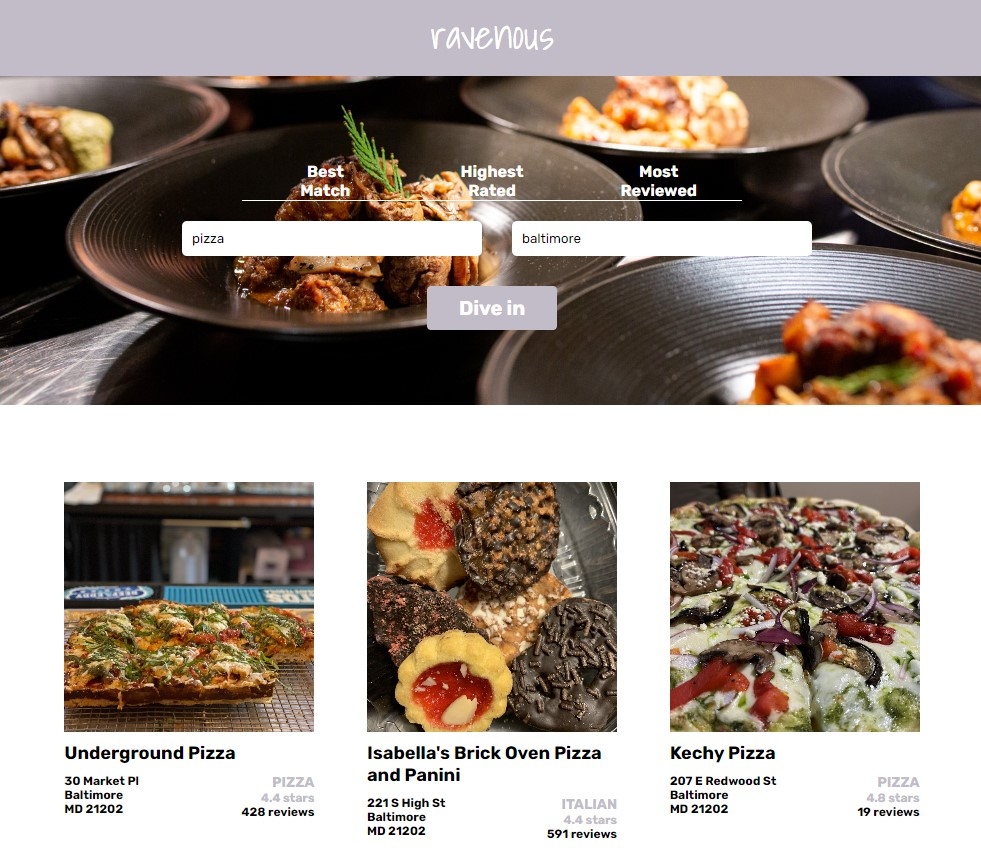

# Ravenous

## Table of contents

- [Overview](#overview)
  - [The challenge](#the-challenge)
  - [Screenshot](#screenshot)
  - [Links](#links)
- [My process](#my-process)
  - [Built with](#built-with)
  - [What I learned](#what-i-learned)
  - [Continued development](#continued-development)
- [Author](#author)

## Overview

### The challenge

Users should be able to:

- Search for Businesses: Users can enter a search term (like a type of cuisine) and a location to find businesses matching their criteria.

- Sort Results: They can choose how the results are sorted (by best match, highest rated, or most reviewed).

- View Business Listings: Once the search is executed, users can see a list of businesses that match their search criteria, including images, names, addresses, ratings, and review counts.

- Handle Errors: The app handles errors gracefully, displaying an error message if there's an issue with the Yelp API or any other part of the process.

- Loading State: During the search, users see a loading indicator to know that the app is fetching data.

- Responsive Design: The app is designed to be responsive, ensuring it works well on different screen sizes and devices.

- User-Friendly Interface: Overall, the app provides a clean and user-friendly interface that makes it easy for users to search for and explore different businesses based on their preferences.

### Screenshot

### Links

- Live Site URL: [View](https://ravenous2-3.netlify.app/)

## My process

- I crafted a robust HTML structure, ensuring semantic integrity and accessibility.
- By breaking down the UI into reusable components, you've embraced a modular approach for scalability and maintainability.
- Integrating dynamic data enriches user experience, while leveraging SCSS for styling adds flexibility and efficiency to your workflow.
- Streamlining the data flow optimizes communication between components, enhancing overall performance.
- Your attention to detail and commitment to best practices set a high standard for web development excellence.

### Built with

- Semantic HTML5 markup
- CSS custom properties
- [Sass](https://sass-lang.com/) - Preprocessor scripting language
- Mobile-Responsive Design
- JavaScript - Scripting language
- [React](https://reactjs.org/) - JS library

### What I learned

This is a project testing all I know on react

### Continued development

Maybe used for reference.

## Author

- Website - [Cameron Howze](https://camkol.github.io/)
- Frontend Mentor - [@camkol](https://www.frontendmentor.io/profile/camkol)
- GitHub- [@camkol](https://github.com/camkol)
- LinkedIn - [@cameron-howze](https://www.linkedin.com/in/cameron-howze-28a646109/)
- E-Mail - [cameronhowze4@outlook.com](mailto:cameronhowze4@outlook.com)
